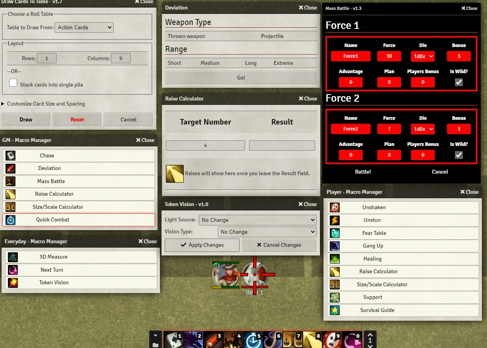
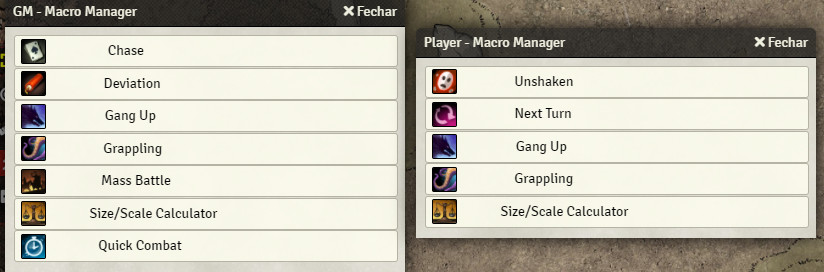
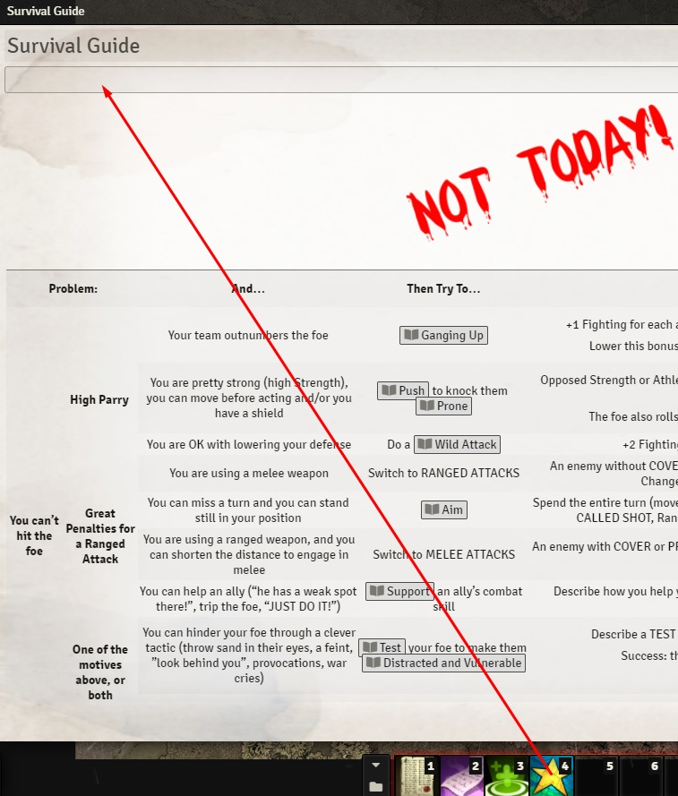
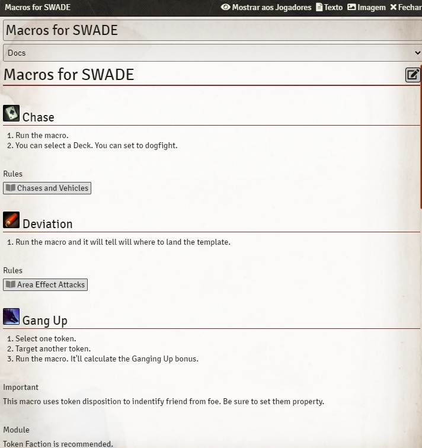

# Macros for SWADE
Simple macros for SWADE.

<table>
<thead>
  <tr>
    <th>
      

        
      

    </th>
  </tr>
  <tr>
    <th>
      

        
      

    </th>    
  </tr>  
  <tr>
    <th>
      

        
      

    </th>    
  </tr>    
</thead>
</table> 

# Instalation

## Foundry VTT
Search **Macros for SWADE** in modules.

## Manual
1. Go to **Modules** and paste this link: 
Use this: https://raw.githubusercontent.com/brunocalado/swademacros/main/module.json

# How To

There is a Journal in the compendium. Read it! All instructions in there.

# Macros

There is a journal with the module with instructions for each macro.

<table>
<thead>
  <tr>
    <th>
      

        
      

    </th>
  </tr>
</thead>
</table>

# Community
- Do you have a cool macro for SWADE? [Share it!](https://github.com/brunocalado/swademacros/issues)
- Do you find out a bug? [Report it!](https://github.com/brunocalado/swademacros/issues)

# Changes
You can see changes at [CHANGELOG](CHANGELOG.md).

# Acknowledgements
- https://github.com/SalieriC/SWADE-Immersive-Macros
- https://github.com/spacemandev-git/swade-macros-simple
- Kristian Serrano [Savaged.us](https://savaged.us/)

# License
Code license at [LICENSE](LICENSE).

Other stuff
- Chair: https://unsplash.com/license